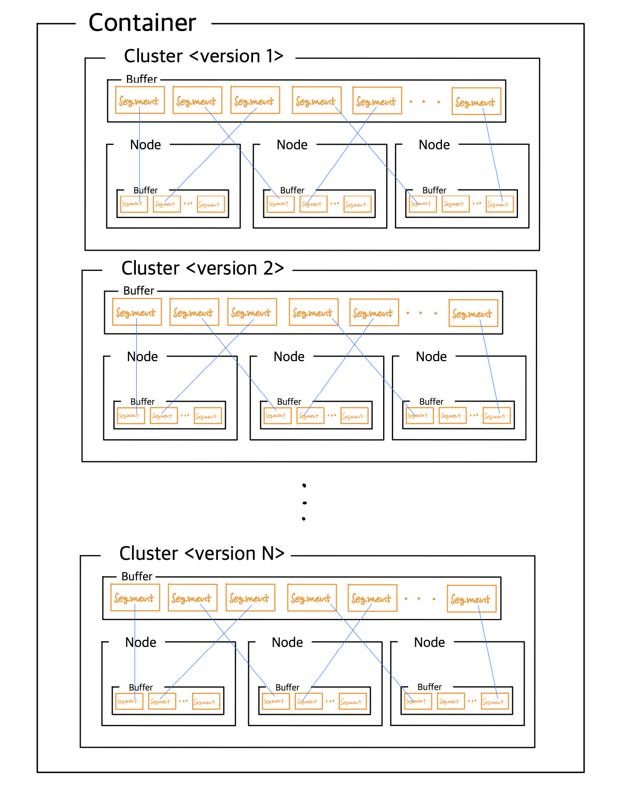

# FAISS 백엔드 내부 자료구조

#### 1. Container 내부는 는 버전별 Cluster 로 관리 됩니다.
- 모델이 변화 함에 따라 임베딩의 버전 역시 자주 변경 되며 AB test 가 가능해야 했기 때문입니다.
#### 2. Cluster 는 자체적으로 관리 되는 Queue 모양의 buffer 와 개별적인 Node 들이 있습니다.
- 전체 기사에 대해서 하루 발행되는 기사량을 조절하기 위한 장치입니다.
#### 3. Node 역시 자체적인 Queue 모양의 buffer 를 가지고 있습니다.
- 개별적인 카테고리별로 발행되는 기사량을 제어하기 위한 장치입니다.
#### 4. Cluster 의 버퍼가 가득 찰 경우 Node가 가지고 있는 숫자에 상관 없이 양쪽에서 Segment Pop
- 각 기사는 개별적인 토픽의 발행량과 전체 발행량에 대해서 동시에 종속적입니다.
#### 5. Node 가 오버플로우가 될 경우 역시 Cluster Buffer의 숫자에 상관 없이 양쪽에서 Segment Pop
- 각 기사는 개별적인 토픽의 발행량과 전체 발행량에 대해서 동시에 종속적입니다.
#### 6. 이렇게 만든 이유는 전체 뉴스기사의 숫자를 보존 하면서 각각의 카테고리별 역시 자기만의 특정 기한이 넘지 않는 방식을 가지길 원했습니다.
